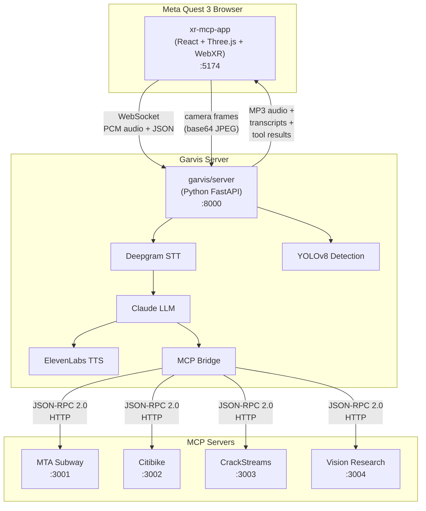
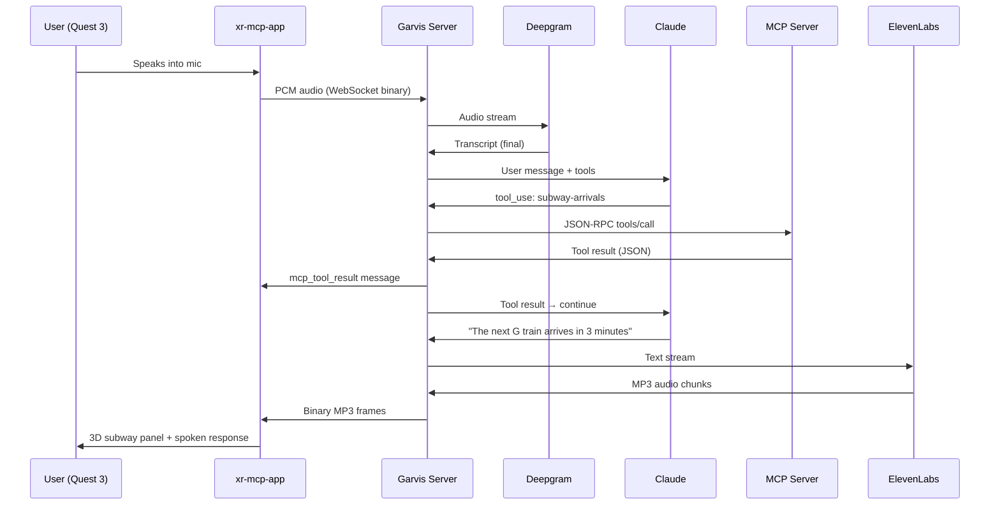
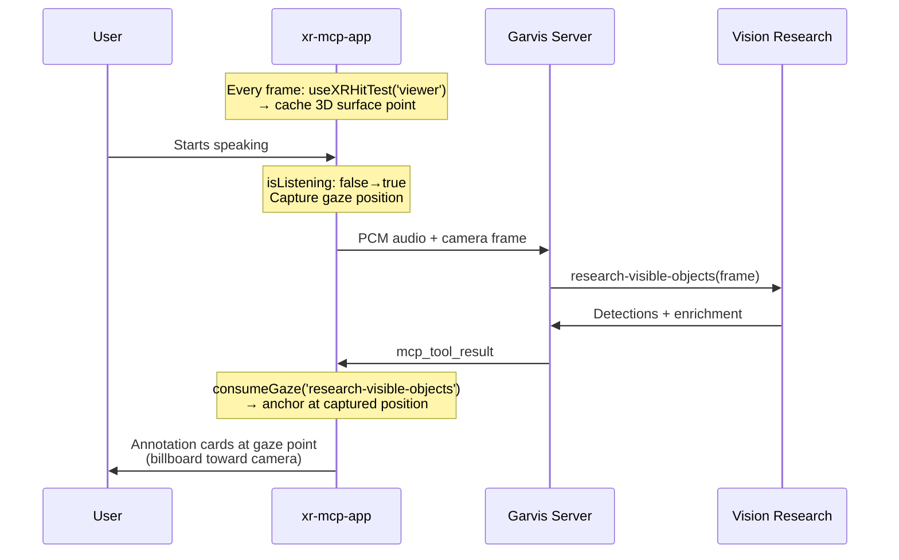
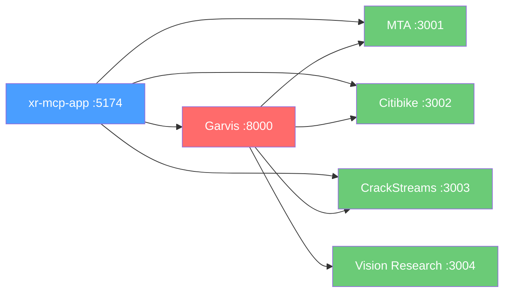

# Architecture Overview

MCP Overlay is a monorepo of six subprojects, each a self-contained building block that contributes a specific capability to the unified AR experience. The integration point is **xr-mcp-app**, which composes voice, vision, and MCP tools into a single WebXR application.

## System Architecture



## How It All Connects

The system follows a **hub-and-spoke** pattern:

1. **xr-mcp-app** is the frontend — it runs in the Quest 3 browser and handles all 3D rendering
2. **Garvis server** is the hub — it receives voice and camera input, orchestrates AI reasoning, and routes tool calls
3. **MCP servers** are the spokes — each provides specialized data (subway times, bike availability, sports streams, vision analysis)

The user never interacts with MCP servers directly. Everything flows through voice:

```
User speaks → Garvis transcribes → Claude reasons → Claude calls MCP tool
→ Tool result sent to XR app → 3D panel appears in AR space
→ Claude generates spoken response → Audio plays back
```

## Dual-Mode Rendering

The XR app has two modes, but only one matters:

| Mode | What Renders | Purpose |
|---|---|---|
| **Browser** | Title + "Enter AR" button | Launcher only |
| **XR (immersive-ar)** | Full 3D scene with all panels | The actual experience |

In XR mode, all UI is pure Three.js — no HTML overlays. Quest 3 silently ignores `dom-overlay`, so every element (text, buttons, windows, charts) is a 3D mesh.

## Data Flow: Voice-Triggered MCP



## Data Flow: Gaze-Anchored Vision

When the user asks about what they're looking at, a special flow captures their gaze position:



## Service Dependencies



- **xr-mcp-app** connects to Garvis via WebSocket and to MCP servers via Vite proxy (for direct tool calls)
- **Garvis** connects to all four MCP servers via the MCP Bridge (for voice-triggered tool calls)
- MCP servers are independent — they don't talk to each other

## Port Map

| Port | Service | Protocol |
|---|---|---|
| 3001 | MTA Subway MCP | HTTP (JSON-RPC) |
| 3002 | Citibike MCP | HTTP (JSON-RPC) |
| 3003 | CrackStreams MCP | HTTP (JSON-RPC) |
| 3004 | Vision Research MCP | HTTP (JSON-RPC) |
| 5173 | Garvis XR client / Vision Explorer 2 | HTTPS |
| 5174 | xr-mcp-app | HTTPS |
| 5180 | MCP App Sandbox frontend | HTTP |
| 5181 | MCP App Sandbox API | HTTP |
| 8000 | Garvis server | HTTP + WebSocket |

## Standalone vs Integrated

Not everything runs together. The monorepo contains both **integrated** services (started by `run.sh`) and **standalone** experiments:

| Service | In run.sh? | Notes |
|---|---|---|
| MTA Subway | Yes | MCP server |
| Citibike | Yes | MCP server |
| CrackStreams | Yes | MCP server |
| Vision Research | Yes | MCP server |
| Garvis server | Yes | Voice + detection hub |
| xr-mcp-app | Yes | Unified AR frontend |
| MCP App Sandbox | No | Browser-based MCP tester (separate workflow) |
| Vision Explorer 2 | No | Standalone app (port 8000 conflicts with Garvis) |
| Manim MCP | No | Separate math tutoring app |

---

**Next:** [Getting Started](Getting-Started.md) | [Garvis](Garvis.md) | [XR MCP App](XR-MCP-App.md)
