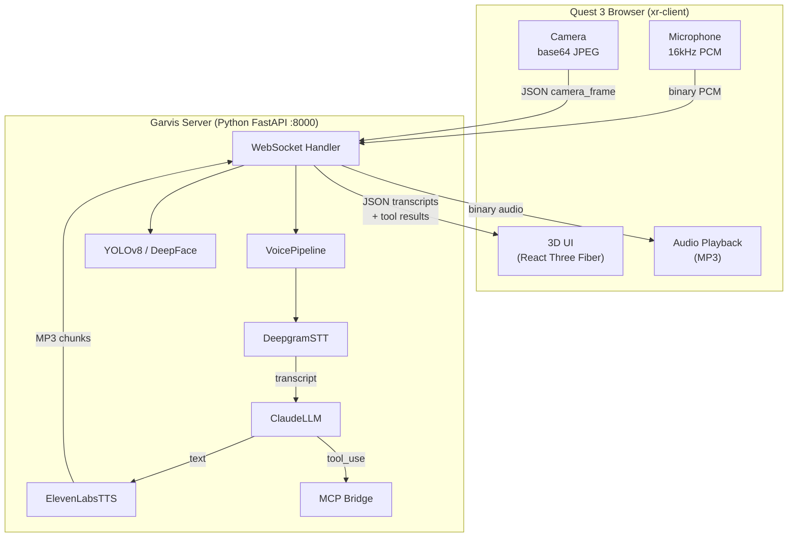

# Garvis

Garvis is the brain of the system — a real-time XR voice assistant that runs on Meta Quest 3. It handles bidirectional audio (Deepgram STT, Claude LLM, ElevenLabs TTS), YOLOv8 object detection, DeepFace face detection, and routes tool calls to external MCP servers via a bridge.

## Architecture



## Server Components

### Voice Pipeline (`server/voice/pipeline.py`)

The central orchestrator. One pipeline per WebSocket connection.

1. **Receives** binary PCM audio from client → forwards to Deepgram
2. **Receives** final transcript from Deepgram → sends to Claude with tools
3. **Claude calls tools** → routes through MCP Bridge or handles natively
4. **Streams Claude's text response** → queues for TTS
5. **ElevenLabs generates MP3** → streams back to client
6. **Tool results** sent as separate JSON messages for 3D rendering

Key design: a `_processing` flag prevents overlapping speech-end handlers (e.g., user says two things quickly).

### Deepgram STT (`server/voice/deepgram_stt.py`)

Real-time speech-to-text over WebSocket.

- **Model:** `nova-2`
- **Features:** VAD (voice activity detection), interim results, smart formatting
- **Utterance end:** 1000ms silence threshold
- **Normalization:** "Jarvis"/"Travis" → "Garvis" (common misheard words)

Emits three events:
- `on_transcript(text, is_final)` — partial and final transcriptions
- `on_speech_end(final_transcript)` — triggers Claude LLM
- `SpeechStarted` — speech begins

### Claude LLM (`server/voice/claude_llm.py`)

Claude with streaming tool calling.

- **Model:** `claude-sonnet-4-20250514`
- **Max tokens:** 1024 (kept short for voice)
- **System prompt:** "Keep responses EXTREMELY brief (1-2 sentences). You are Garvis (rhymes with Jarvis)."
- **Max tool iterations:** 10

The `stream_response_with_tools()` generator yields events as they arrive — text chunks stream to TTS in real time, tool calls execute inline.

### ElevenLabs TTS (`server/voice/elevenlabs_tts.py`)

Low-latency text-to-speech with real-time streaming.

- **Voice:** George (`JBFqnCBsd6RMkjVDRZzb`)
- **Model:** `eleven_turbo_v2_5`
- **Output:** MP3, 44.1kHz, 128kbps

Architecture: three queues (text → synthesis thread → audio queue → WebSocket sender). Text arrives from Claude in small chunks and is synthesized as it arrives — no waiting for the full response.

### MCP Bridge (`server/tools/mcp_bridge.py`)

Connects Garvis to external MCP servers. Initialized at app startup.

```python
MCP_SERVERS = [
    {"name": "mta",              "url": "http://localhost:3001/mcp"},
    {"name": "citibike",         "url": "http://localhost:3002/mcp"},
    {"name": "crackstreams",     "url": "http://localhost:3003/mcp"},
    {"name": "vision-research",  "url": "http://localhost:3004/mcp"},
]
```

On startup, the bridge connects to each server, calls `tools/list` to discover tools, and converts them to Claude API format. When Claude calls a tool, the bridge routes the call to the correct server via HTTP JSON-RPC 2.0.

Special case: `research-visible-objects` automatically gets the latest camera frame injected as input.

### Object Detection (`server/tools/vision/`)

- **YOLOv8** (`detect.py`): Lazy-loads `yolov8n.pt` (nano model). Returns bounding boxes with class labels for 80 COCO categories.
- **DeepFace** (`face_detect.py`): RetinaFace backend for accurate face detection. Falls back to YOLO person detection if DeepFace fails. Can extract face crops as base64 JPEG.

## XR Client (`xr-client/`)

The original Garvis frontend — a standalone XR app. The `xr-mcp-app` is the newer unified version that builds on this.

### Key Components

```
xr-client/src/
├── App.tsx                          # Main XR app
├── design-system/
│   ├── components/Window.tsx        # Draggable, resizable 3D window
│   ├── tokens.ts                    # Design tokens (colors, spacing in meters)
│   └── primitives.ts               # Rounded geometry, pointer helpers
├── ecs/
│   ├── world.ts                     # Koota ECS world
│   ├── traits.ts                    # ChatHistory, VoiceState, ActiveVideo, etc.
│   └── actions.ts                   # State mutations
├── features/
│   ├── chat/ChatWindow.tsx          # Chat transcript HUD
│   └── video/VideoWindow.tsx        # HLS video stream player
├── hooks/
│   ├── useXRCamera.ts               # Camera capture (Raw API + getUserMedia fallback)
│   ├── useFaceDetection.ts          # Face detection polling
│   └── useDetection.ts              # Object detection polling
└── voice/
    ├── garvis-client.ts             # WebSocket client
    └── useVoiceAssistant.ts         # React hook wrapping GarvisClient
```

### ECS (Entity-Component-System)

Uses **Koota** for global state instead of React context/Redux:

| Trait | Data | Purpose |
|---|---|---|
| `ChatHistory` | `messages[]` | Conversation log |
| `VoiceState` | listening, speaking, processing... | Pipeline status |
| `VisorConfig` | position, scale, distance | Window layout (persisted to localStorage) |
| `ActiveVideo` | url, playing | HLS stream state |
| `SettingsUIState` | open/closed | Settings panel |

### Window Component

The `Window.tsx` component is the foundation of all XR UI:

- **Draggable** — grab title bar with pointer, uses `setPointerCapture`
- **Resizable** — bottom-right handle, distance-based scaling (0.5x–2.0x)
- **Two position modes:**
  - `visor` — camera-locked HUD (follows all head movement)
  - `yaw` — world-horizontal, only follows yaw rotation
- **Smooth animation** — lerp/slerp when idle, instant during drag
- **Persistence** — positions saved to localStorage per window

This component was ported to `xr-mcp-app` as `XRWindow.tsx` with an additional `worldPosition` mode for gaze-anchored panels.

## Key Files

| File | Purpose |
|---|---|
| `server/main.py` | FastAPI app entry, CORS, router setup |
| `server/config.py` | API keys, model config, system prompt, MCP server list |
| `server/voice/pipeline.py` | Voice pipeline orchestration |
| `server/voice/websocket.py` | WebSocket endpoint (`/ws/voice`) |
| `server/voice/deepgram_stt.py` | Deepgram real-time STT |
| `server/voice/claude_llm.py` | Claude with streaming tool calling |
| `server/voice/elevenlabs_tts.py` | ElevenLabs real-time TTS |
| `server/tools/mcp_bridge.py` | MCP client registry and routing |
| `server/tools/mcp_client.py` | HTTP JSON-RPC MCP client |
| `xr-client/src/design-system/components/Window.tsx` | Draggable 3D window |
| `xr-client/src/ecs/traits.ts` | ECS state definitions |
| `xr-client/src/voice/garvis-client.ts` | WebSocket voice client |

---

**Deep dive:** [Voice Pipeline](Voice-Pipeline.md) | **Related:** [XR MCP App](XR-MCP-App.md) | [MCP Integration Patterns](MCP-Integration-Patterns.md)
