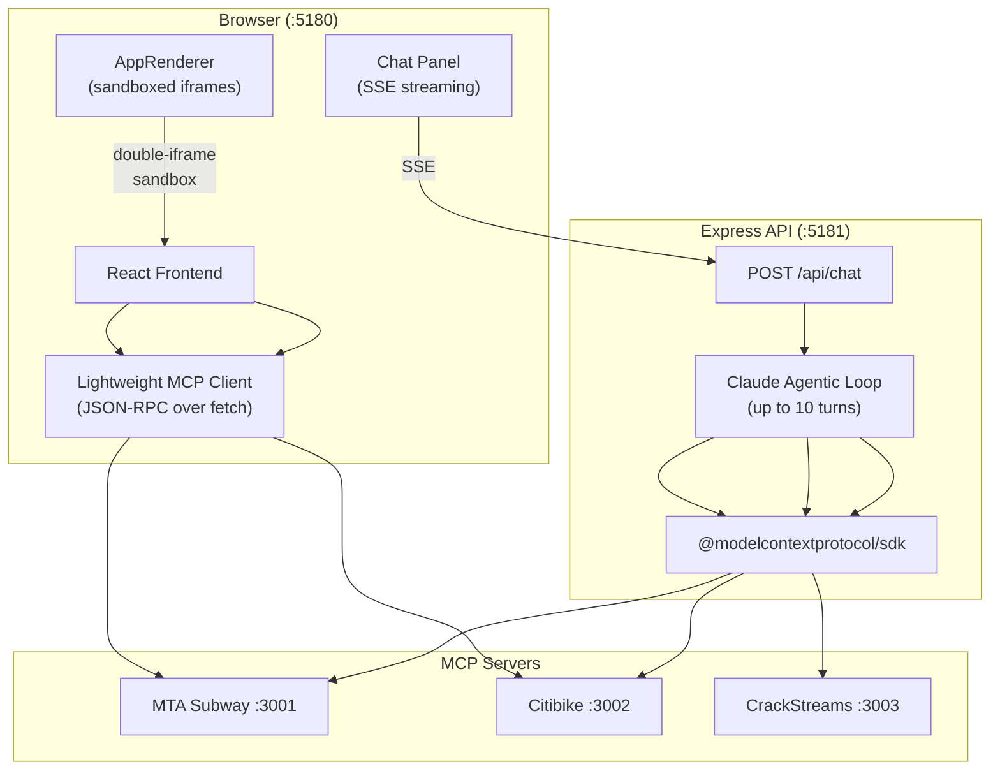
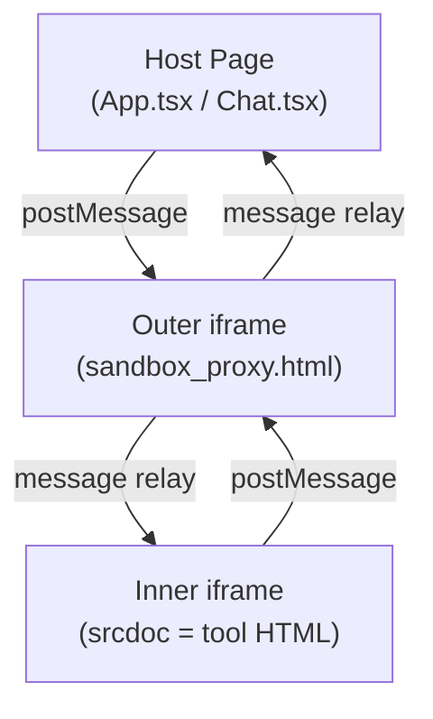

# MCP App Sandbox

A browser-based tool for connecting to MCP servers, executing tools, viewing MCP App UIs in sandboxed iframes, and chatting with a Claude-powered agent. Also hosts three MCP servers: MTA Subway, Citibike, and CrackStreams.

## What It Does

Think of it as a workbench for MCP development:

1. **Connect** to any MCP server by URL
2. **Browse** available tools
3. **Execute** tools and see raw JSON results
4. **View** MCP App UIs (interactive HTML rendered in sandboxed iframes)
5. **Chat** with an AI agent that uses the tools autonomously

## Architecture



## Three-Panel Layout

```
┌──────────┬────────────────────┬──────────────┐
│ Sidebar  │   Main Content     │  Chat Panel  │
│ (280px)  │                    │  (420px)     │
│          │                    │              │
│ Server   │ Tool execution     │ AI agent     │
│ URL      │ form + results     │ with SSE     │
│          │                    │ streaming    │
│ Tools    │ MCP App UI         │              │
│ list     │ (AppRenderer)      │ Inline tool  │
│          │                    │ results +    │
│          │                    │ MCP App UIs  │
└──────────┴────────────────────┴──────────────┘
```

## AI Chat Agent

The chat panel connects to the Express API, which runs a Claude agentic loop:

1. User sends message + selected MCP server URL
2. Backend connects to MCP server, discovers tools
3. Claude receives message + tool definitions
4. Claude calls tools as needed (up to 10 turns)
5. Each event streams back via SSE:
   - `text_delta` — Claude's text response
   - `tool_use_start` — tool call initiated
   - `tool_execution_complete` — tool result (with `resourceHtml` if MCP App UI exists)
   - `complete` — stream end

If a tool returns `structuredContent.resource.uri`, the backend fetches the resource HTML and includes it in the SSE event. The frontend renders it inline in the chat via `AppRenderer`.

## MCP App UI Sandboxing

MCP App UIs are interactive HTML applications returned by tools. They run in a **double-iframe sandbox**:



**Why double-iframe?** Security. The outer iframe is a static proxy that only relays messages. The inner iframe contains the actual tool UI (potentially untrusted HTML) with strict sandbox attributes.

**Communication flow:**
1. `AppRenderer` loads `sandbox_proxy.html` in outer iframe
2. Proxy signals ready: `ui/notifications/sandbox-proxy-ready`
3. AppRenderer sends HTML: `ui/notifications/sandbox-resource-ready`
4. Proxy creates inner iframe with `srcdoc=html`
5. Inner app can call server tools: `app.callServerTool()` → relayed to host → sent to MCP server

## Hosted MCP Servers

### MTA Subway (`:3001`)

NYC subway real-time arrivals. TypeScript + `@modelcontextprotocol/sdk`.

**Tools:**
| Tool | Has UI? | Description |
|---|---|---|
| `subway-arrivals` | Yes | Real-time countdown for a specific line + station |
| `search-stations` | No | Find stations by name, optionally filter by line |
| `show-dashboard` | Yes | Multi-panel grid showing multiple lines/stations |

The dashboard tool is notable — it spawns child iframes, each running the single-station MCP App, with an `AppBridge` proxying tool calls from children through the parent.

**Data source:** MTA GTFS real-time feeds.

### Citibike (`:3002`)

Citi Bike station availability. TypeScript + `@modelcontextprotocol/sdk`.

**Tools:**
| Tool | Has UI? | Description |
|---|---|---|
| `citibike-status` | Yes | Classic/ebike counts, dock availability, capacity bar |
| `search-citibike` | No | Find stations by name |

The UI auto-refreshes every 60 seconds with a manual refresh button.

**Data source:** GBFS (General Bikeshare Feed Specification) API.

### CrackStreams (`:3003`)

Live sports streaming. Python FastAPI + FastMCP.

**Tools:**
| Tool | Has UI? | Description |
|---|---|---|
| `search-streams` | No | Search for live games by query + content type |
| `show-stream` | No | Get proxy URL for HLS playback |
| `ping` | No | Health check |

Uses a **provider registry** pattern — abstract base class with `search()` and `get_stream_info()` methods, supporting multiple stream sources.

## File Map

```
mcp-app-sandbox/
├── src/
│   ├── App.tsx              # Main UI: connection, tool list, execution, AppRenderer
│   ├── Chat.tsx             # AI chat: SSE parsing, inline tool results + MCP Apps
│   ├── chat-types.ts        # TypeScript interfaces for messages
│   ├── mcp.ts               # Lightweight JSON-RPC MCP client (no SDK)
│   ├── main.tsx             # React entry
│   └── app.css              # Dark theme, three-panel layout
├── public/
│   └── sandbox_proxy.html   # Double-iframe security proxy
├── server/
│   └── api.ts               # Express POST /api/chat (agentic loop + SSE)
├── mta-subway/
│   ├── server.ts            # MCP server (tools + resources)
│   ├── src/mcp-app.ts       # Single station MCP App UI
│   ├── src/dashboard-app.ts # Multi-panel dashboard UI
│   ├── data/                # Feed URLs, line colors, station DB
│   └── lib/                 # GTFS feed fetcher
├── citibike/
│   ├── server.ts            # MCP server
│   ├── src/mcp-app.ts       # Station status widget UI
│   └── lib/                 # GBFS feed fetcher
└── crackstreams/
    ├── main.py              # FastAPI + FastMCP
    ├── providers/            # Stream source plugins
    ├── streaming/            # HLS helpers
    └── proxy.py              # Stream proxying
```

---

**Related:** [MCP Integration Patterns](MCP-Integration-Patterns.md) | [Architecture Overview](Architecture-Overview.md)
