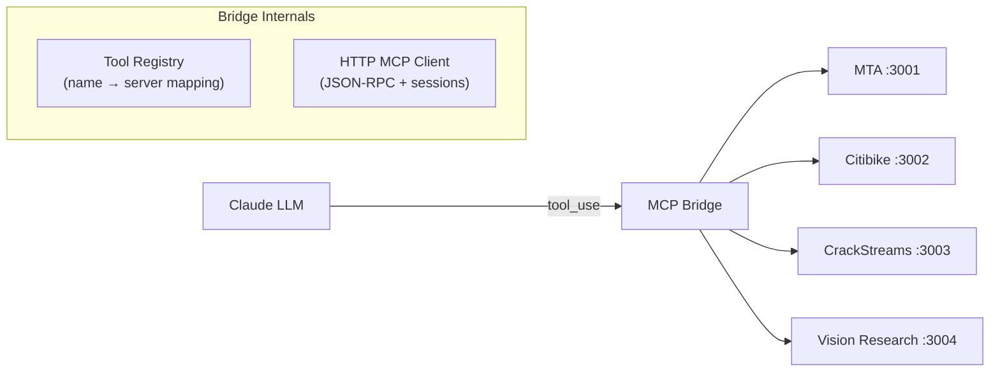

# MCP Integration Patterns

The Model Context Protocol (MCP) is used throughout the monorepo for tool calling between AI and services. Three implementation patterns exist: Python FastMCP servers, TypeScript SDK servers, and lightweight browser clients.

## Protocol Overview

All MCP communication uses **JSON-RPC 2.0 over HTTP** (Streamable HTTP transport):

```json
// Request
{
  "jsonrpc": "2.0",
  "method": "tools/call",
  "params": {
    "name": "subway-arrivals",
    "arguments": { "line": "G", "station": "Greenpoint Av" }
  },
  "id": 1
}

// Response
{
  "jsonrpc": "2.0",
  "result": {
    "content": [{ "type": "text", "text": "{...json...}" }]
  },
  "id": 1
}
```

Sessions persist via the `mcp-session-id` HTTP header, returned by the server on `initialize` and sent by clients on all subsequent requests.

## Three Implementation Patterns

### 1. Python FastMCP Servers

Used by: **Garvis**, **Vision Research**, **CrackStreams**, **Manim MCP**

```python
from fastmcp import FastMCP
from fastapi import FastAPI

mcp = FastMCP("my-server")
app = FastAPI()

@mcp.tool()
async def my_tool(param: str) -> str:
    """Tool description for Claude."""
    return json.dumps({"result": "data"})

# Mount MCP on FastAPI
app.mount("/mcp", mcp.http_app())
```

The `@mcp.tool()` decorator auto-generates the tool schema from the function signature and docstring. FastMCP handles JSON-RPC routing, session management, and the Streamable HTTP transport.

### 2. TypeScript SDK Servers

Used by: **MTA Subway**, **Citibike**

```typescript
import { McpServer } from "@modelcontextprotocol/sdk/server/mcp.js";
import { StreamableHTTPServerTransport } from "@modelcontextprotocol/sdk/server/streamableHttp.js";

const server = new McpServer({ name: "my-server", version: "1.0.0" });

server.tool("my-tool", { param: z.string() }, async ({ param }) => ({
  content: [{ type: "text", text: JSON.stringify({ result: "data" }) }],
}));

// Express endpoint
app.all("/mcp", async (req, res) => {
  const transport = new StreamableHTTPServerTransport({ sessionIdGenerator: () => randomUUID() });
  await server.connect(transport);
  await transport.handleRequest(req, res, req.body);
});
```

Uses Zod for input validation. The SDK manages JSON-RPC parsing and response formatting.

### 3. Browser Clients (No SDK)

Used by: **xr-mcp-app**, **mcp-app-sandbox** frontend

```typescript
// Lightweight JSON-RPC client (no @modelcontextprotocol/sdk dependency)
class MCPClient {
  private sessionId: string | null = null;

  async request(method: string, params?: Record<string, unknown>) {
    const res = await fetch(this.url, {
      method: "POST",
      headers: {
        "Content-Type": "application/json",
        ...(this.sessionId && { "mcp-session-id": this.sessionId }),
      },
      body: JSON.stringify({ jsonrpc: "2.0", method, params, id: this.nextId++ }),
    });
    this.sessionId ??= res.headers.get("mcp-session-id");
    return (await res.json()).result;
  }

  async initialize() { return this.request("initialize", { ... }); }
  async listTools() { return this.request("tools/list"); }
  async callTool(name: string, args: object) { return this.request("tools/call", { name, arguments: args }); }
}
```

No SDK needed in the browser — just fetch + JSON-RPC conventions. Session ID is captured from the first response and sent on all subsequent requests.

## Garvis MCP Bridge

Garvis acts as both an **MCP server** (native tools) and an **MCP client** (bridge to external servers). The bridge is the key integration mechanism.



**Startup flow:**
1. Bridge iterates through configured MCP servers
2. For each: `initialize` → `tools/list` → store tools with server mapping
3. Tools are converted to Claude API format and provided to the LLM

**Runtime flow:**
1. Claude emits `tool_use` with a tool name
2. Bridge checks `is_mcp_tool(name)` → finds which server owns it
3. Bridge calls `tools/call` on the correct server via HTTP
4. Result returned to Claude for continued reasoning
5. Result also sent to the XR client as `mcp_tool_result` for 3D rendering

**Special handling:** When `research-visible-objects` is called, the bridge auto-injects the latest camera frame (stored in `_latest_frame`) as an argument.

## MCP App UIs (Structured Content)

Some tools return interactive HTML UIs via the `structuredContent` field:

```typescript
// Server returns:
{
  content: [{ type: "text", text: "..." }],          // For the LLM
  structuredContent: {                                 // For the UI
    resource: {
      uri: "ui://subway-arrivals/mcp-app.html",
      mimeType: "text/html",
      text: "<html>...</html>"
    }
  }
}
```

The `content` field is for Claude (text it can reason about). The `structuredContent.resource` is for the frontend (HTML to render). This dual-output pattern lets a single tool serve both AI reasoning and human visualization.

**Registration pattern** (used by MTA, Citibike):

```typescript
// Register tool with App UI
import { registerAppTool } from "@modelcontextprotocol/ext-apps";

registerAppTool(server, "subway-arrivals", {
  // ... tool definition
  appHtml: bundledHtmlString,  // Pre-built HTML (Vite-bundled)
});
```

The HTML app communicates with the host via `AppBridge`:
- `app.connect()` — establish connection
- `app.callServerTool({ name, arguments })` — call other MCP tools from within the UI
- `app.ontoolinput` / `app.ontoolresult` — callbacks for tool lifecycle

## Server Inventory

| Server | Language | Framework | Port | Path | Tools |
|---|---|---|---|---|---|
| MTA Subway | TypeScript | MCP SDK | 3001 | `/mcp` | subway-arrivals, search-stations, show-dashboard |
| Citibike | TypeScript | MCP SDK | 3002 | `/mcp` | citibike-status, search-citibike |
| CrackStreams | Python | FastMCP | 3003 | `/mcp` | search-streams, show-stream, ping |
| Vision Research | Python | FastMCP | 3004 | `/mcp` | research-visible-objects |
| Garvis | Python | FastMCP | 8000 | `/mcp` | ping (+ bridge to all above) |
| Manim MCP | Python | FastMCP | 8000 | `/mcp/math` | render_custom_scene, show_video |

## Tool Result Display Markers

Two string patterns in tool results trigger special rendering in frontends:

| Marker | Used By | Frontend Action |
|---|---|---|
| `[DISPLAY_STREAM:url]` | CrackStreams via Garvis | Open HLS video player |
| `[DISPLAY_VIDEO:path]` | Manim MCP | Show rendered animation |

These are detected by string matching in the frontend's response parser — a simple convention that avoids protocol-level complexity.

---

**Related:** [Garvis](Garvis.md) | [MCP App Sandbox](MCP-App-Sandbox.md) | [Architecture Overview](Architecture-Overview.md)
