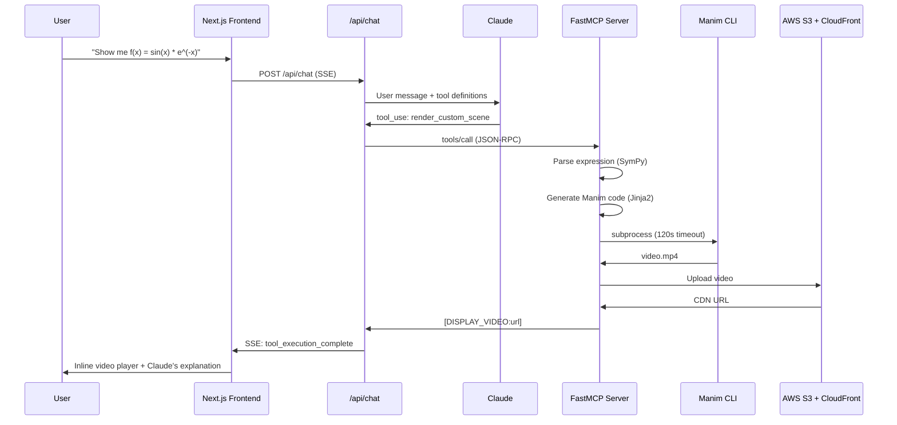

# Manim MCP

An AI math tutoring platform that renders Manim animations from math expressions via MCP tools. Users chat with Claude, which can generate and render mathematical visualizations on the fly.

## How It Works



## Architecture

### Backend (`server/`, Python)

```
server/
├── server.py                  # FastAPI + FastMCP at /mcp/math
├── core/
│   ├── expression_parser.py   # SymPy parse + whitelist + complexity validation
│   ├── code_generation.py     # Jinja2 templates → Manim Python code
│   ├── renderer.py            # Subprocess manim CLI (120s timeout)
│   ├── s3_storage.py          # Upload to S3, return CloudFront URL
│   ├── auth.py                # Auth0 JWT (commented out)
│   └── validate_inputs.py     # Input validation
├── tools/
│   ├── base.py                # ToolRegistry, BaseVisualizationTool
│   ├── utilities.py           # ShowVideoTool, RenderCustomSceneTool
│   ├── algebra/               # Plot2D, Compare2D, Transformation2D
│   └── three_d/               # Plot3DSurface, Compare3D, Transformation3D
└── apps/
    └── lesson_viewer.py       # MCP App UI for inline video player
```

### Frontend (`web-client/`, Next.js 15)

```
web-client/src/
├── app/
│   ├── page.tsx               # Home page
│   └── api/
│       ├── chat/route.ts      # POST /api/chat (Claude + SSE + agentic loop)
│       ├── video/route.ts     # Video proxy
│       └── tools/route.ts     # List MCP tools
├── components/
│   ├── ChatInterface.tsx      # SSE parsing, tool call display, KaTeX math
│   └── ui/
│       ├── tool-call-display.tsx   # Renders tool calls + results
│       └── mcp-app-display.tsx     # Iframe sandbox for MCP App UIs
├── lib/
│   ├── mcp-client.ts          # MCPHTTPClient (SDK wrapper)
│   └── config.ts              # MCP server URL, model config
└── hooks/
    └── useChat.ts             # Chat state + localStorage persistence
```

## Expression Processing Pipeline

### 1. Parse (SymPy)

User math expressions are parsed with SymPy's `parse_expr()`:
- **Whitelist** of allowed functions and variables (sin, cos, exp, x, y, z...)
- **Complexity limit** of 1000 atoms (prevents abuse)
- Rejects dangerous expressions that could execute arbitrary code

### 2. Generate (Jinja2)

AST is converted to Manim Python code via Jinja2 templates:
- Template-based (not f-string) to prevent code injection
- Configurable quality levels: low, medium, high, production
- Outputs a complete `.py` file with `Scene` class

### 3. Render (subprocess)

Manim CLI runs in a subprocess:
- 120-second timeout
- Output to `server/media/videos/`
- Returns video file path

### 4. Upload (S3)

Rendered videos are uploaded to AWS S3 with CloudFront CDN URL returned.

## Tool Registry Pattern

Tools use an abstract base class + singleton registry:

```python
class BaseVisualizationTool:
    metadata: ToolMetadata  # name, description, category, examples
    def execute(self, **kwargs) -> dict: ...

class ToolRegistry:  # singleton
    def register(self, tool): ...
    def get(self, name): ...
```

**Categories:** `ALGEBRA_2D`, `ALGEBRA_3D`, `CALCULUS`, `LINEAR_ALGEBRA`, `DISCRETE_MATH`, `UTILITIES`

Currently active tools:
- `render_custom_scene` — Generate and render any Manim scene from a prompt
- `show_video` — Display a previously rendered video

Many tools are defined but commented out (Plot2D, Compare2D, etc.) — available for future use.

## Agentic Loop

The frontend's `/api/chat` route runs Claude with up to **100 tool iterations** (vs 10 in MCP App Sandbox). Claude can:
1. Call `render_custom_scene` with a math expression
2. Receive the rendered video URL
3. Explain the visualization
4. Call another tool if the user asks for modifications

The `[DISPLAY_VIDEO:{path}]` marker in tool results triggers the inline video player in the frontend.

## SSE Event Types

Shared protocol with MCP App Sandbox:

| Event | Data |
|---|---|
| `text_start` | New text block beginning |
| `text_delta` | Streamed text chunk |
| `text_stop` | Text block complete |
| `tool_use_start` | Tool call initiated (name) |
| `tool_input_delta` | Streaming tool input |
| `tool_use_stop` | Tool input complete |
| `tool_execution_start` | Tool running |
| `tool_execution_complete` | Tool result (possibly with video URL) |
| `complete` | Stream finished |
| `error` | Error message |

## Key Dependencies

**Server:** FastAPI, FastMCP, SymPy, Manim, Jinja2, boto3, Anthropic SDK
**Frontend:** Next.js 15, React 19, `@modelcontextprotocol/sdk`, KaTeX, Tailwind CSS

## Running

```bash
# Both services (tmux)
./start-app.sh

# Or manually:
cd server && uv sync && uv run uvicorn server:app --host 0.0.0.0 --port 8000 --reload
cd web-client && npm install && npm run dev    # → :3000
```

**Note:** Server uses port 8000, which conflicts with Garvis. Not in `run.sh`.

---

**Related:** [MCP Integration Patterns](MCP-Integration-Patterns.md) | [Architecture Overview](Architecture-Overview.md)
