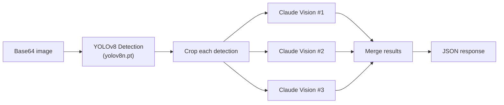
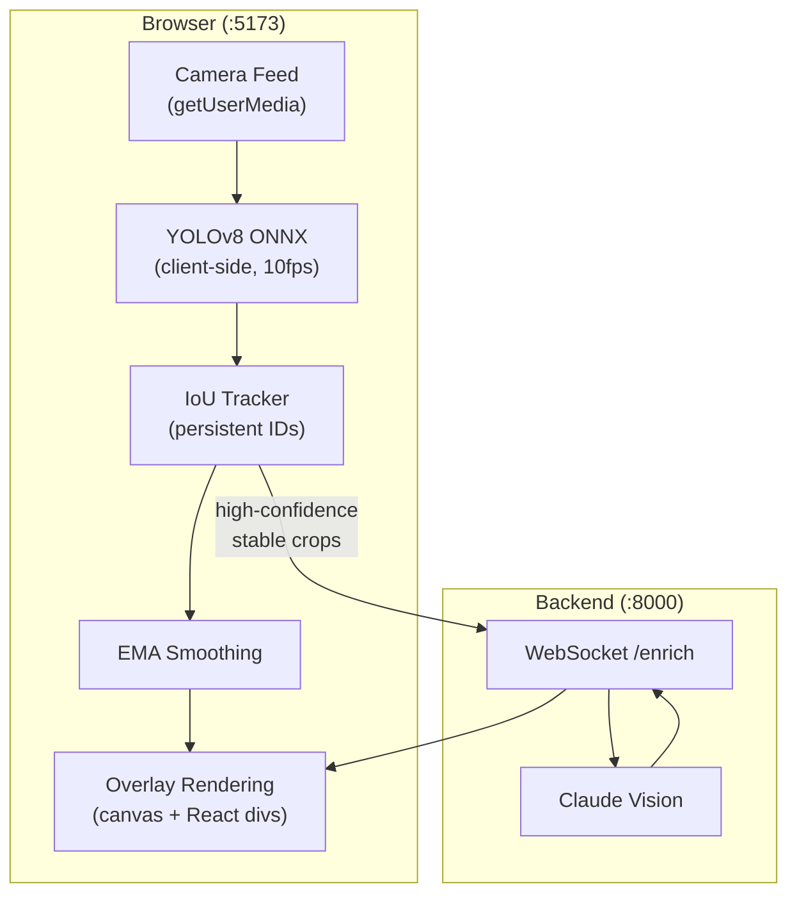

# Vision Servers

Two subprojects handle computer vision: **Vision Research Server** (MCP tool for the integrated system) and **Vision Explorer 2** (standalone real-time detection app). Both use YOLOv8 for detection and Claude Vision for enrichment, but with different architectures.

## Vision Research Server

An MCP server exposing a single tool: `research-visible-objects`. Takes a camera frame, runs YOLO detection, then enriches each detected object with Claude Vision analysis in parallel.

### How It Works



**Key design:** Enrichment calls run in parallel with a semaphore (max 5 concurrent) to avoid hitting API rate limits.

### Tool Output

```json
{
  "success": true,
  "count": 2,
  "image_size": {"width": 1280, "height": 720},
  "objects": [
    {
      "id": 0,
      "class": "bottle",
      "confidence": 0.92,
      "bbox": {"x1": 100, "y1": 200, "x2": 200, "y2": 400},
      "identification": {
        "name": "Fiji Water",
        "brand": "Fiji",
        "category": "beverages",
        "description": "500ml natural artesian water"
      },
      "enrichment": {
        "summary": "Premium imported water from Fiji islands",
        "price_estimate": "$2.50",
        "specs": {"volume": "500ml", "type": "still"},
        "search_query": "Fiji Water 500ml"
      }
    }
  ]
}
```

### Dual Prompt Strategy

Claude Vision gets different prompts depending on what was detected:
- **Persons:** Focuses on activity and context ("What is this person doing? What's notable?")
- **Products:** Focuses on identification and specs ("What brand? What model? Estimated price?")

### Graceful Fallback

If Claude Vision fails for a detection (API error, unparseable response), it returns the YOLO label only instead of crashing. Markdown code fence stripping handles Claude's tendency to wrap JSON in backticks.

### Files

```
vision-research-server/
├── server.py          # FastAPI + FastMCP, research-visible-objects tool
├── detect.py          # YOLOv8 inference (lazy-loaded nano model)
├── vision_llm.py      # Claude Vision API (structured prompts, JSON parsing)
└── config.py          # YOLO_CONFIDENCE=0.4, MAX_DETECTIONS=10, MAX_CONCURRENT=5
```

**Port:** 3004 | **Dependencies:** FastAPI, FastMCP, Ultralytics, Anthropic SDK, Pillow

---

## Vision Explorer 2

A standalone real-time detection app — not integrated into the main system. Runs YOLO **client-side** via ONNX Runtime Web (no server-side detection), with Claude Vision enrichment over WebSocket.

### Architecture



### Client-Side Detection Pipeline

1. **useCamera** — `getUserMedia` with `facingMode: "environment"` (rear camera on mobile)
2. **useYOLO** — Loads `yolov8n.onnx` from `public/models/`, runs at 10fps
   - Pre-processing: resize to 640x640, transpose to NCHW format
   - Post-processing: non-maximum suppression (NMS) to remove overlapping boxes
3. **useTracking** — IoU-based tracker with 50% threshold
   - Maintains persistent track IDs across frames
   - Same object keeps the same ID even as it moves
4. **EMA smoothing** — Exponential moving average (factor 0.7) on bounding boxes to prevent jitter

### Enrichment Gate

Not every detection gets sent for enrichment. The gate requires:
- Confidence > 0.85
- Stable for 2+ seconds (same track ID persisted)
- Not already enriched (prevents duplicate API calls)
- Results cached by track ID

### Render Layers

Three stacked layers for the UI:

```
Layer 3: React overlay divs (ObjectOverlay → CollapsedPill / ExpandedCard)
Layer 2: Canvas (bounding box rectangles, pure canvas API)
Layer 1: <video> element (native camera feed, 30fps)
```

Object overlays have a lifecycle: `detected → enriching → ready → expanded`

### Performance Caps

- Max 8 simultaneous overlays (highest confidence wins)
- `React.memo` on all overlay components
- 1-second grace period before unmounting (prevents flicker on brief occlusion)
- WebSocket auto-reconnect with exponential backoff (1s, 2s, 4s, max 10s)

### Files

```
vision-explorer2/
├── frontend/src/
│   ├── App.tsx                    # Orchestrates hooks
│   ├── hooks/
│   │   ├── useCamera.ts           # getUserMedia
│   │   ├── useYOLO.ts             # ONNX model + 10fps inference
│   │   ├── useTracking.ts         # IoU tracker
│   │   └── useEnrichment.ts       # WebSocket client
│   ├── lib/
│   │   ├── yolo.ts                # Pre/post processing, NMS
│   │   ├── tracker.ts             # IoU matching (50% threshold)
│   │   └── smoothing.ts           # EMA (factor 0.7)
│   ├── components/
│   │   ├── CameraFeed.tsx
│   │   ├── BoundingBoxCanvas.tsx
│   │   ├── ObjectOverlay.tsx      # Pill/card lifecycle
│   │   ├── CollapsedPill.tsx
│   │   └── ExpandedCard.tsx
│   └── store/useStore.ts          # Zustand state
└── backend/
    ├── main.py                    # FastAPI WebSocket /enrich
    ├── vision_llm.py              # Claude Vision
    └── models.py                  # Pydantic schemas
```

**Frontend:** React 18, TypeScript, Vite, pnpm, Zustand, Tailwind CSS, ONNX Runtime Web
**Backend:** Python FastAPI, Anthropic SDK

### Gotchas

- Uses **pnpm** (not npm like other Node projects)
- Backend port 8000 **conflicts with Garvis** — can't run both
- ONNX model files must be in `public/models/`, not `src/` (Vite doesn't bundle them)
- Not in `run.sh` — standalone experiment

---

## Comparison

| | Vision Research Server | Vision Explorer 2 |
|---|---|---|
| **YOLO runs** | Server-side (Python) | Client-side (ONNX in browser) |
| **Transport** | MCP (JSON-RPC HTTP) | WebSocket |
| **Integration** | Part of main system (via Garvis bridge) | Standalone |
| **Enrichment** | Parallel (semaphore-limited) | Per-crop (gated by confidence + stability) |
| **In run.sh** | Yes (:3004) | No (port conflict) |
| **Use case** | Voice-triggered object research | Real-time continuous detection |

---

**Related:** [XR MCP App](XR-MCP-App.md) | [Garvis](Garvis.md) | [Architecture Overview](Architecture-Overview.md)
