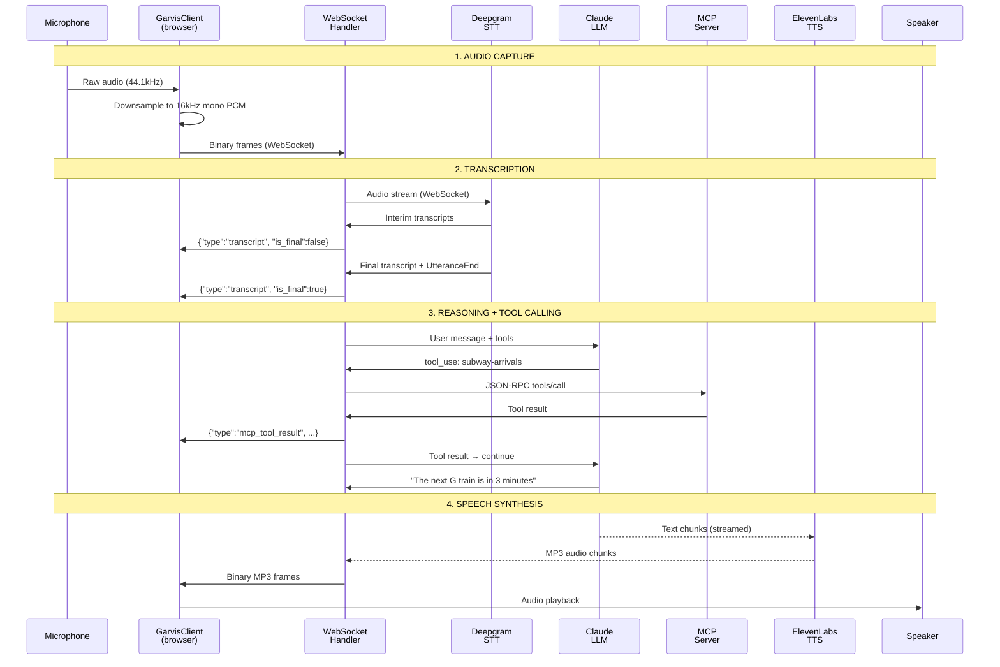
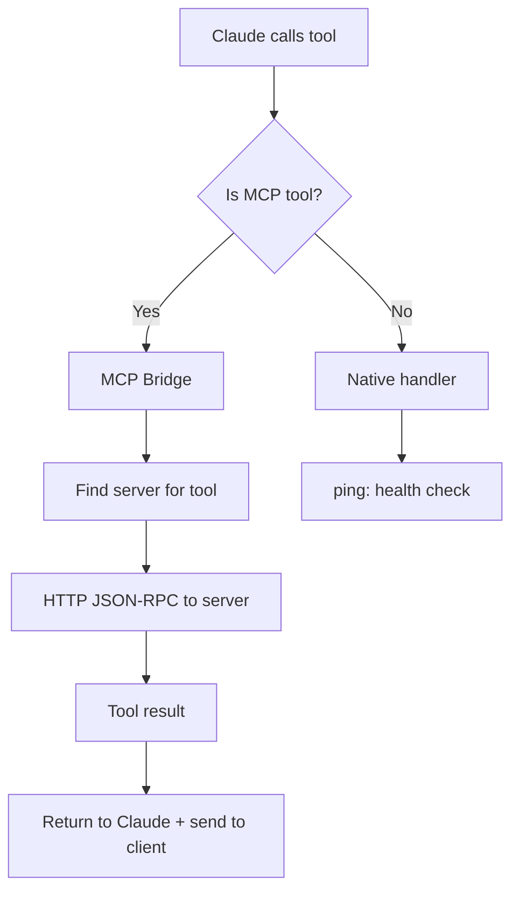
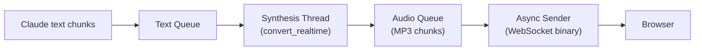
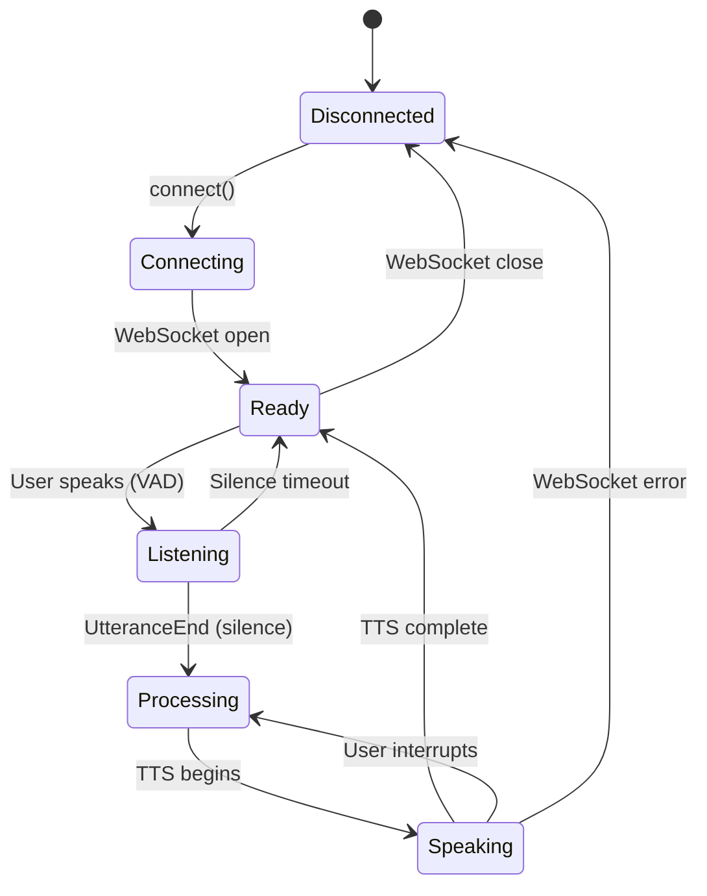

# Voice Pipeline

The voice pipeline is the core interaction mechanism — the user speaks, Garvis listens, thinks, acts, and responds. This page traces the complete journey of a voice interaction from microphone to speaker.

## End-to-End Flow



## Stage 1: Audio Capture (Browser)

**File:** `xr-mcp-app/src/voice/garvis-client.ts`

The `GarvisClient` class handles microphone capture:

1. `getUserMedia({ audio: { channelCount: 1, sampleRate: 16000 } })`
2. Create `AudioContext` + `ScriptProcessorNode` (deprecated but reliable)
3. In the `onaudioprocess` callback:
   - Get Float32 audio samples
   - Convert to 16-bit PCM (Int16Array)
   - If not muted, send as binary WebSocket frame
4. When muted, samples are silently dropped (ScriptProcessor still runs)

**Key detail:** The audio context runs at the device's native sample rate (typically 44.1kHz or 48kHz on Quest 3). The `ScriptProcessorNode` receives samples at native rate, but requesting 16kHz in `getUserMedia` constraints lets the browser handle downsampling.

## Stage 2: Transcription (Deepgram)

**File:** `garvis/server/voice/deepgram_stt.py`

Deepgram provides real-time STT over its own WebSocket:

```
Client audio → Garvis server → Deepgram WebSocket
                                    ↓
                            Interim transcripts
                            Final transcript
                            UtteranceEnd event
```

**Configuration:**
| Parameter | Value | Purpose |
|---|---|---|
| Model | `nova-2` | Latest and most accurate |
| Encoding | `linear16` | PCM 16-bit |
| Sample rate | `16000` | 16kHz |
| Smart format | enabled | Auto-punctuation, number formatting |
| VAD events | enabled | Voice activity detection |
| Interim results | enabled | Real-time partial transcripts |
| Utterance end | `1000ms` | Silence threshold for speech end |
| Endpointing | `300ms` | Faster response time |

**Normalization:** Deepgram sometimes hears "Jarvis" or "Travis" instead of "Garvis". The server normalizes these in post-processing.

**Events emitted:**
- `on_transcript(text, is_final)` → forwarded to client as JSON
- `on_speech_end(final_transcript)` → triggers Claude LLM
- `SpeechStarted` → forwarded to client for UI state

## Stage 3: LLM Reasoning (Claude)

**File:** `garvis/server/voice/claude_llm.py`

When Deepgram emits `UtteranceEnd`, the voice pipeline triggers Claude:

```python
async for event in claude_llm.stream_response_with_tools(
    messages=conversation_history,
    execute_tool=self._execute_tool
):
    if event["type"] == "text":
        # Stream to TTS immediately
        tts.add_text(event["content"])
        # Send transcript to client
        send_json({"type": "transcript", "role": "assistant", "text": event["content"]})

    elif event["type"] == "tool_use":
        # Execute tool via MCP bridge
        result = await execute_tool(event["name"], event["input"])
        # Send tool result to client for 3D rendering
        send_json({"type": "mcp_tool_result", "tool_name": event["name"], "content": result})
```

**System prompt** keeps Claude brief for voice:
> "Keep responses EXTREMELY brief — 1-2 sentences max. You are Garvis, an AR assistant."

**Tool iteration limit:** 10 (prevents infinite tool loops)

**Processing guard:** A `_processing` flag prevents overlapping `_handle_speech_end` calls if the user speaks two things quickly. The second utterance waits.

### Tool Execution Routing



**Special case — vision:** When Claude calls `research-visible-objects`, the pipeline automatically injects the latest camera frame (stored from the most recent `camera_frame` WebSocket message).

## Stage 4: Speech Synthesis (ElevenLabs)

**File:** `garvis/server/voice/elevenlabs_tts.py`

TTS runs in parallel with Claude's response — text is synthesized as it's generated, not after the full response:



**Configuration:**
| Parameter | Value |
|---|---|
| Voice | George (`JBFqnCBsd6RMkjVDRZzb`) |
| Model | `eleven_turbo_v2_5` (fast) |
| Output | MP3, 44.1kHz, 128kbps |
| Stability | 0.5 |
| Similarity boost | 0.75 |
| Speaker boost | enabled |

**Three-queue architecture:**
1. **Text queue** — Claude's text chunks arrive here
2. **Synthesis thread** — Worker thread runs `convert_realtime()` from ElevenLabs SDK, consuming text as it arrives
3. **Audio queue** — MP3 chunks produced by synthesis → async task sends over WebSocket

This pipelining means the user starts hearing the response while Claude is still generating text.

## Stage 5: Audio Playback (Browser)

**File:** `xr-mcp-app/src/voice/garvis-client.ts`

The client receives binary WebSocket frames (MP3 chunks):

1. Accumulate chunks in an array
2. When server signals `isSpeaking: false`, combine all chunks into a single `Blob`
3. Create blob URL → play via `<audio>` element
4. Clean up blob URL after playback

**Interruption:** If the user starts speaking while Garvis is talking, the client sends `{"type": "interrupt"}` and stops audio playback.

## WebSocket Protocol

The voice WebSocket (`/ws/voice`) carries both binary and JSON messages:

### Client → Server

| Type | Format | Content |
|---|---|---|
| Audio | Binary | 16-bit PCM, 16kHz, mono |
| Camera frame | JSON | `{"type": "camera_frame", "frame": "base64_jpeg"}` |
| Interrupt | JSON | `{"type": "interrupt"}` |
| Mute toggle | JSON | `{"type": "mute", "muted": true}` |

### Server → Client

| Type | Format | Content |
|---|---|---|
| TTS audio | Binary | MP3 chunks |
| Transcript | JSON | `{"type": "transcript", "text": "...", "is_final": bool, "role": "user"\|"assistant"}` |
| Status | JSON | `{"type": "status", "isListening": bool, "isSpeaking": bool}` |
| Tool result | JSON | `{"type": "mcp_tool_result", "tool_name": "...", "content": [...]}` |
| Stream URL | JSON | `{"type": "stream_url", "url": "..."}` |
| Error | JSON | `{"type": "error", "message": "..."}` |

## State Machine



The XR client shows this state via `VoiceIndicator3D`:
| State | Color | Label |
|---|---|---|
| Disconnected | Gray | "Disconnected" |
| Ready | Green | "Ready" |
| Listening | Green (pulsing) | "Listening..." |
| Processing | Yellow | "Thinking..." |
| Speaking | Blue | "Speaking..." |
| Error | Red | "Error" |

## Connection Management

### Deferred Connection
`useVoiceAssistant` waits 500ms after being enabled before connecting. This lets the XR session stabilize (camera permissions, audio context) before opening the WebSocket.

### Deduplication
A `connectingRef` boolean prevents duplicate connections during the async handshake (WebSocket open + server ready).

### No StrictMode
React StrictMode was removed from `main.tsx` because it double-fires effects, which would create two WebSocket connections.

---

**Related:** [Garvis](Garvis.md) | [XR MCP App](XR-MCP-App.md) | [Architecture Overview](Architecture-Overview.md)
