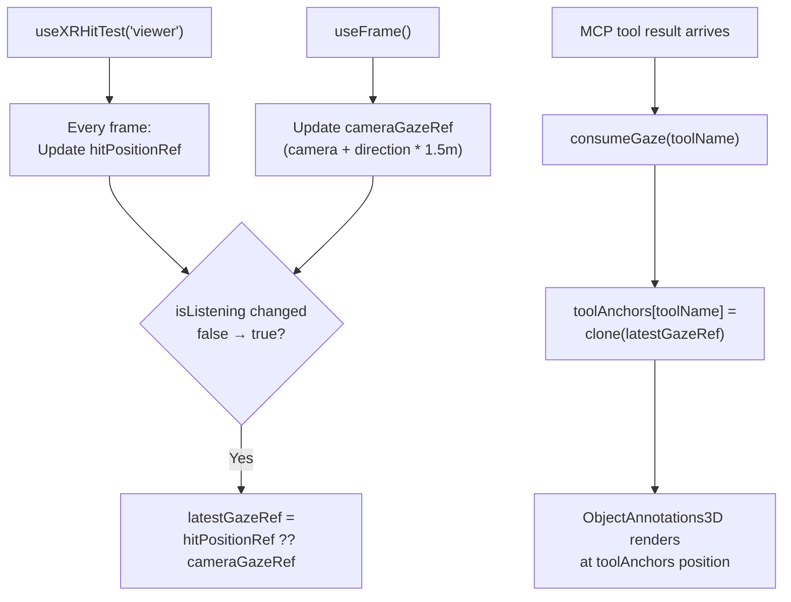

# WebXR Rendering

All XR UI in mcp-overlay is pure Three.js — no HTML overlays. This page covers the 3D rendering system: the Window component, gaze anchoring, design tokens, and Quest 3 constraints.

## Why No HTML?

Quest 3's browser silently ignores the `dom-overlay` WebXR feature (it's designed for handheld AR, not headsets). Any attempt to use HTML overlays in immersive-ar mode will:
- Not crash
- Not error
- Simply not render

So every UI element — text, buttons, panels, charts, indicators — is a Three.js mesh rendered in WebGL.

## Tech Stack

```
React Three Fiber (@react-three/fiber)   — React renderer for Three.js
@react-three/drei                        — 3D UI primitives (Text, etc.)
@react-three/xr                          — WebXR integration (controllers, hit test, etc.)
Three.js                                  — 3D graphics engine
```

React Three Fiber lets you write Three.js scenes as JSX:

```tsx
// Instead of imperative Three.js:
const mesh = new THREE.Mesh(geometry, material);
scene.add(mesh);

// You write declarative React:
<mesh geometry={geometry} material={material} />
```

## Window Component

**File:** `xr-mcp-app/src/components/XRWindow.tsx` (ported from `garvis/xr-client/src/design-system/components/Window.tsx`)

Every panel in the XR scene is a `Window` — a draggable, resizable 3D container.

### Visual Structure

```
┌─────────────────────────────┐
│ [icon]  Title        [X]    │  ← Title bar (drag handle)
├─────────────────────────────┤
│                             │
│     Content area            │  ← Children rendered here
│     (Three.js group)        │
│                             │
│                          ◢  │  ← Resize handle
└─────────────────────────────┘
```

- **Background:** Rounded rectangle mesh with glassmorphism opacity
- **Title bar:** Text + optional action buttons + close button
- **Content:** A `<group>` positioned below the title bar
- **Resize handle:** Bottom-right corner, distance-based scaling

### Three Positioning Modes

| Mode | Behavior | Use Case |
|---|---|---|
| `visor` | Follows all camera movement (position + rotation) | Chat window, voice indicator |
| `yaw` | Follows horizontal rotation only, stable vertically | — |
| `worldPosition` | Fixed in world space, billboards toward camera | Gaze-anchored annotations |

**Implementation:** In `useFrame()` (runs every render frame):
- **Idle:** `lerp` position toward target (factor 0.15), `slerp` rotation
- **Dragging:** Position updates instantly (no lerp) for responsive feel

### Drag System

1. User points at title bar → `onPointerDown`
2. `setPointerCapture(event.pointerId)` — captures pointer for reliable tracking
3. `onPointerMove` → calculate new position from pointer ray
4. `onPointerUp` → release capture, resume lerp smoothing

### Resize System

1. User grabs bottom-right handle
2. Scale changes based on pointer distance from window center
3. Clamped between 0.5x and 2.0x
4. Applied uniformly (x, y, z scale)

### Persistence

Window positions and scales save to `localStorage` with keys like `garvis-window-chat`, `garvis-window-subway`. On reload, windows restore their last position.

## Gaze Anchoring

**File:** `xr-mcp-app/src/hooks/useGazeAnchor.ts`

Vision research results don't follow the camera — they anchor to where the user was looking when they asked the question.

### How It Works



### Why useFrame, Not useEffect?

The gaze position is captured inside `useFrame()` — the per-frame render callback — not in a React `useEffect`. This is critical because:

- `useEffect` runs asynchronously after render, potentially missing the frame where `isListening` changed
- `useFrame` runs synchronously within the render loop, guaranteeing same-frame hit test data
- The hit test result from `useXRHitTest` is only valid during the current frame

### Fallback

If `useXRHitTest('viewer')` returns no result (pointing at empty space, unsupported device), the hook uses:

```
fallback position = camera.position + camera.forward * 1.5 meters
```

This places the annotation 1.5 meters in front of the user — a reasonable default.

### Per-Tool Consumption

`consumeGaze(toolName)` copies (not references) the gaze position into `toolAnchors`:

```typescript
toolAnchors['research-visible-objects'] = latestGazeRef.clone();
```

The `clone()` is important — without it, all tool anchors would share the same Vector3 reference and move together.

Currently only `research-visible-objects` uses gaze anchoring. Other panels (subway, citibike, sports) stay in visor mode.

## Design Tokens

**File:** `xr-mcp-app/src/design-system.ts`

A minimal set of design tokens for consistent 3D UI, measured in **meters** (Three.js world units):

### Colors
```
surface.primary:    #1a1a2e  (dark background)
surface.secondary:  #16213e  (slightly lighter)
text.primary:       #ffffff
text.secondary:     #b0b0b0
accent.primary:     #4a9eff  (blue highlights)
status.success:     #4ade80  (green — listening/ready)
status.warning:     #fbbf24  (yellow — processing)
status.error:       #f87171  (red — error)
```

### Typography (in meters)
```
title:   0.016m  (~16mm, readable at arm's length)
body:    0.012m  (~12mm)
caption: 0.009m  (~9mm)
```

### Spacing (in meters)
```
base:  0.008m  (8mm)
sm:    0.004m
md:    0.012m
lg:    0.016m
```

### Z-Layers
Prevents depth fighting between overlapping UI elements:
```
background: 0.000
content:    0.001
chrome:     0.002
overlay:    0.003
```

### Helper: Rounded Rectangles
```typescript
createRoundedRectGeometry(width, height, radius): THREE.BufferGeometry
```

Used for window backgrounds, buttons, status badges. Creates a `ShapeGeometry` from a Three.js `Shape` with `quadraticCurveTo` corners.

## Data-Driven 3D Rendering

Instead of embedding HTML iframes in XR (impossible on Quest 3), each MCP tool result is parsed from JSON and rendered as native 3D elements:

```tsx
// SubwayArrivals3D.tsx (simplified)
function SubwayArrivals3D({ data }: { data: SubwayData }) {
  return (
    <group>
      {/* Station name */}
      <Text fontSize={0.016} color="#ffffff">
        {data.station}
      </Text>

      {/* Line circle (colored) */}
      <mesh>
        <circleGeometry args={[0.015, 32]} />
        <meshBasicMaterial color={LINE_COLORS[data.line]} />
      </mesh>

      {/* Arrival times */}
      {data.arrivals.map((arr, i) => (
        <Text key={i} fontSize={0.012} position={[0, -0.03 * i, 0]}>
          {arr.direction} — {arr.minutes}min
        </Text>
      ))}
    </group>
  );
}
```

This pattern — parse JSON, render as `<Text>` + `<mesh>` — is used by all tool components. Pure WebGL, works on Quest 3.

## Voice Indicator

**File:** `xr-mcp-app/src/components/VoiceIndicator3D.tsx`

A pulsing sphere that shows voice state:

| State | Color | Animation |
|---|---|---|
| Ready | Green | Static |
| Listening | Green | Pulsing (scale oscillation via `Math.sin`) |
| Processing | Yellow | Static |
| Speaking | Blue | Static |
| Disconnected | Gray | Static |
| Error | Red | Static |

The pulse animation runs in `useFrame`:
```typescript
const scale = 1 + Math.sin(clock.elapsedTime * 3) * 0.1;
mesh.scale.setScalar(scale);
```

## Camera Access on Quest 3

**File:** `xr-mcp-app/src/hooks/useXRCamera.ts`

Two strategies for accessing the passthrough camera:

### Strategy 1: WebXR Raw Camera Access (future)
```typescript
const binding = new XRWebGLBinding(session, gl);
const cameraImage = binding.getCameraImage(view);
// → GPU texture with exact projection matrix
```

**Status:** NOT available on Quest browser as of v85. The session rejects `camera-access` feature. Code is ready for when Meta ships it.

### Strategy 2: getUserMedia (current fallback)
```typescript
const stream = await navigator.mediaDevices.getUserMedia({
  video: { facingMode: "environment" }
});
// → Standard camera stream (no projection matrix)
```

### Pre-Acquisition Timing

Quest 3 only grants camera permission during XR session creation. The hook calls `preAcquireCamera()` in the `xrStore.subscribe` callback:

```typescript
xrStore.subscribe((state) => {
  if (state.session) {
    preAcquireCamera(); // Must happen during session init
  }
});
```

If called too late, permission is silently denied.

## Quest 3 Specific Constraints

| Constraint | Workaround |
|---|---|
| No `dom-overlay` | All UI is Three.js meshes |
| No Raw Camera Access (yet) | Fall back to getUserMedia |
| HTTPS required | Vite `@vitejs/plugin-basic-ssl` for dev |
| No React StrictMode | Removed (prevents duplicate WebSocket connections) |
| Limited GPU | Keep mesh count low, use `Text` sparingly |
| 90Hz refresh | `useFrame` runs 90x/sec — keep logic light |

---

**Related:** [XR MCP App](XR-MCP-App.md) | [Garvis](Garvis.md) | [Architecture Overview](Architecture-Overview.md)
