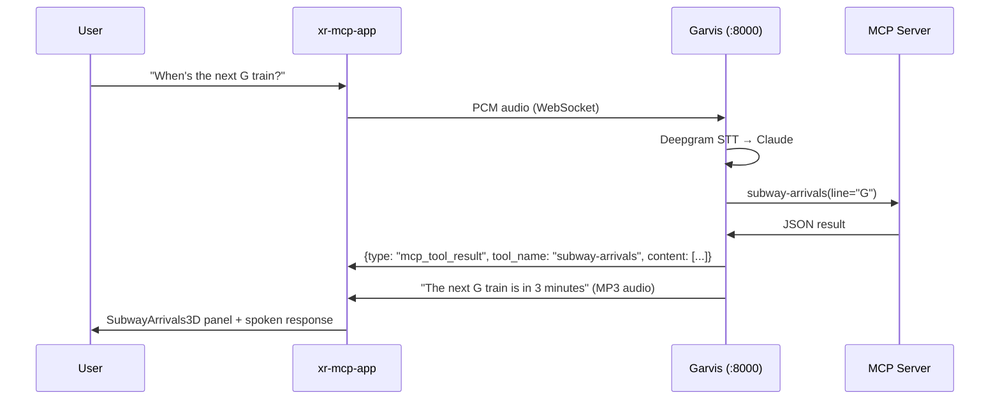
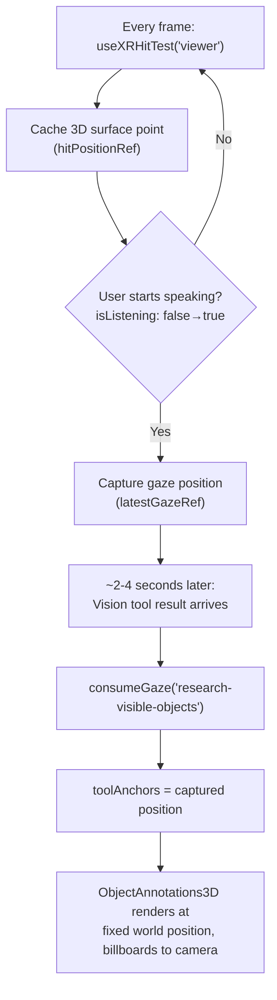

# XR MCP App

The unified AR application — the integration point where voice, vision, and MCP tools converge into a single WebXR experience on Meta Quest 3. All MCP tool results are rendered as native 3D panels triggered by voice through Garvis.

## Component Tree

```
App.tsx (useVoiceAssistant + useGazeAnchor)
├── Browser mode: title + "Enter AR" button (launcher only)
└── Canvas > XR
      └── <XRScene />
            ├── <Window> + <ChatWindow3D />             (chat transcript)
            ├── <Window> + <VoiceIndicator3D />          (status sphere)
            ├── <Window> + <SubwayArrivals3D />          (voice-triggered)
            ├── <Window> + <CitiBikeStatus3D />          (voice-triggered)
            ├── <Window> + <SportsSearch3D />             (voice-triggered)
            ├── <Window> + <VideoPlayer3D />              (voice-triggered)
            ├── <DetectionOverlay3D />                    (YOLO bounding boxes)
            └── <ObjectAnnotations3D />                   (gaze-anchored)
```

Every panel is a draggable, resizable `Window` component. Users grab the title bar to reposition any window in 3D space and use the resize handle to scale. Positions persist to localStorage.

## Voice-Triggered MCP Flow

Nothing appears until the user speaks. The flow:



## Tool → Component Mapping

Each MCP tool has a dedicated 3D renderer:

| Tool Name | Component | Renders |
|---|---|---|
| `subway-arrivals` | `SubwayArrivals3D` | Station name, colored line circle, N/S direction arrows, arrival countdown |
| `citibike-status` | `CitiBikeStatus3D` | Station name, classic/ebike counts (color-coded), docks available, capacity bar |
| `search-streams` | `SportsSearch3D` | Game list with league badges, titles, times |
| `show-stream` | `VideoPlayer3D` | HLS video player (parses stream URL from JSON) |
| `research-visible-objects` | `ObjectAnnotations3D` | Object detection cards with identification + enrichment (gaze-anchored) |

All components parse raw JSON from `mcpToolResults[toolName].content[0].text` and render it as `<Text>` and `<mesh>` primitives — pure WebGL, no HTML.

## Gaze Anchoring

Vision results are special — they anchor to where the user was looking when they started speaking, not as a HUD element.



**Fallback:** If hit testing returns nothing (empty space, unsupported device), uses camera position + gaze direction * 1.5m.

Only `research-visible-objects` uses gaze anchoring. Other panels stay in visor (HUD) mode.

## Key Hooks

### `useVoiceAssistant`

Wraps `GarvisClient` in React state. Manages:
- `messages[]` — chat history with streaming updates
- `mcpToolResults` — `Record<string, MCPToolResult>` keyed by tool name
- `isConnected`, `isListening`, `isSpeaking`, `isProcessing`, `isMuted`

Design decisions:
- 500ms connection delay to let XR session stabilize
- `connectingRef` guard prevents duplicate WebSocket connections
- Streaming messages use timestamp-based upsert (replace or append)

### `useGazeAnchor`

Continuous WebXR hit testing + gaze capture.
- Runs `useXRHitTest('viewer')` every frame inside `useFrame` (not `useEffect`) to get same-frame hit data
- Captures position on `isListening` transition
- `consumeGaze(toolName)` copies position to `toolAnchors` (clones Vector3 for immutability)

### `useXRCamera`

Camera frame capture for vision tools.
- Attempts WebXR Raw Camera Access API first (not yet available on Quest)
- Falls back to `getUserMedia`
- Pre-acquires camera during XR session init (Quest timing requirement)

### `useCameraFrameSender`

Streams camera frames to Garvis at 1fps.
- Separate from detection loop (which runs at 3fps)
- Sends base64 JPEG over WebSocket as `camera_frame` control message

## Window Component (`XRWindow.tsx`)

Ported from `garvis/xr-client/src/design-system/components/Window.tsx`. Three positioning modes:

| Mode | Behavior | Used By |
|---|---|---|
| `visor` | Camera-locked HUD, follows all head movement | Chat, Voice indicator |
| `yaw` | World-horizontal, only follows yaw rotation | — |
| `worldPosition` | Fixed in world space, billboards toward camera | ObjectAnnotations3D |

Features:
- **Drag:** title bar pointer events with `setPointerCapture`
- **Resize:** bottom-right handle, distance-based scaling (0.5x–2.0x)
- **Close button** per window
- **Smooth animation:** lerp (0.15 factor) when idle, instant during drag
- **Persistence:** localStorage with `garvis-window-{storageKey}` keys

## Design System (`design-system.ts`)

Inlines a minimal subset of garvis tokens (no cross-project imports):

- **Colors:** surface, text, accent, status (success/warning/error)
- **Typography:** sizes in meters (0.012 for body, 0.016 for titles)
- **Spacing:** in meters (0.008 base unit)
- **Opacity:** glassmorphism levels (background: 0.85, chrome: 0.6)
- **Z-layers:** prevents depth fighting between UI elements
- **Helper:** `createRoundedRectGeometry()` for panel backgrounds

## Vite Configuration

```
Port: 5174 (HTTPS via @vitejs/plugin-basic-ssl)
Proxies:
  /mcp              → http://localhost:3001  (MTA)
  /citibike-mcp     → http://localhost:3002  (Citibike, rewritten to /mcp)
  /crackstreams-mcp → http://localhost:3003  (CrackStreams, rewritten to /mcp)
  /proxy            → http://localhost:3003  (HLS stream proxy)
  /ws/voice         → ws://localhost:8000    (Garvis WebSocket)
  /detect           → http://localhost:8000  (YOLO detection)
```

HTTPS is required because WebXR APIs need a secure context, even on localhost.

## File Map

| File | Purpose |
|---|---|
| `src/App.tsx` | Top-level: XR store, hooks, voice-only panel layout |
| `src/main.tsx` | React entry (no StrictMode — prevents duplicate WebSocket connections) |
| `src/hooks/useVoiceAssistant.ts` | Voice state bridge |
| `src/hooks/useGazeAnchor.ts` | Hit testing + gaze capture |
| `src/hooks/useXRCamera.ts` | Camera access (Raw API + fallback) |
| `src/hooks/useCameraFrameSender.ts` | 1fps frame streaming |
| `src/hooks/useDetection.ts` | 3fps YOLO detection loop |
| `src/voice/garvis-client.ts` | WebSocket voice client |
| `src/components/XRWindow.tsx` | Draggable/resizable 3D window |
| `src/components/ChatWindow3D.tsx` | Chat transcript + status bar |
| `src/components/SubwayArrivals3D.tsx` | MTA data → 3D text |
| `src/components/CitiBikeStatus3D.tsx` | Citibike data → 3D text |
| `src/components/SportsSearch3D.tsx` | Sports listings → 3D text |
| `src/components/VideoPlayer3D.tsx` | HLS video in 3D |
| `src/components/ObjectAnnotations3D.tsx` | Gaze-anchored vision results |
| `src/components/VoiceIndicator3D.tsx` | Status sphere with pulse |
| `src/components/DetectionOverlay3D.tsx` | YOLO bounding boxes |
| `src/design-system.ts` | Colors, spacing, typography tokens |
| `src/mcp.ts` | Lightweight JSON-RPC MCP client |

---

**Deep dive:** [WebXR Rendering](WebXR-Rendering.md) | **Related:** [Garvis](Garvis.md) | [Voice Pipeline](Voice-Pipeline.md)
